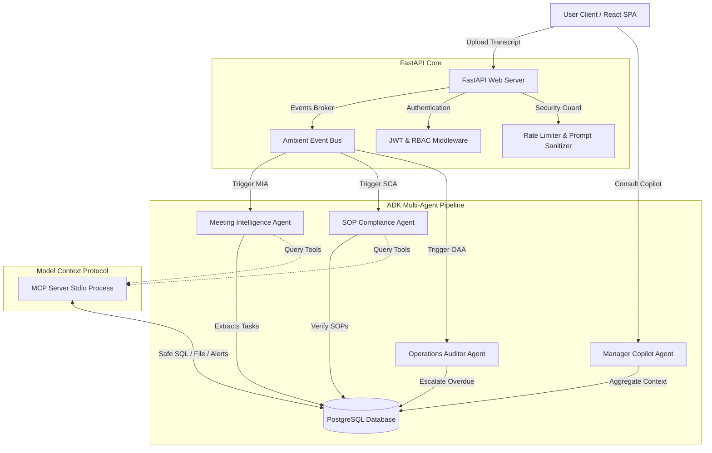

# Meeting2Execution AI (M2E Hub)

An enterprise-ready, multi-agent AI pipeline that extracts action items from meeting transcript dialogs, validates compliance against Standard Operating Procedures (SOPs), tracks tasks lifecycle, dispatches manager notifications, and exposes a natural-language analytics copilot.

---

## 1. System Architecture

Below is the conceptual architecture of the Meeting2Execution AI platform. It utilizes FastAPI, SQLAlchemy, PostgreSQL, and Google ADK (Agent Development Kit) agents powered by Gemini.



---

## 2. Key Features

* **Meeting Intelligence Agent (MIA):** Uses Google ADK to parse raw dialogues, identifying tasks, assignees, deadlines, risks, and dependencies.
* **SOP Compliance Agent (SCA):** Audits tasks against department SOP documents, checking required sections, and placing failing tasks into `Triage` status automatically.
* **Operations Auditor Agent (OAA):** Scans for overdue tasks and triggers alerts.
* **Manager Copilot Agent:** A conversational agent resolving leadership queries (e.g. *"Who is overloaded?"*, *"What is overdue?"*).
* **Model Context Protocol (MCP) Server:** Integrates PostgreSQL queries, transcript loading, calendar event scheduling, and notification alerts via stdio JSON-RPC.
* **Ambient Event Broker:** Event bus triggering workflows in the background.
* **Security & Audits:** IP rate limit guards, case-insensitive prompt injection sanitizers, file-size validators, and database security audit logging.

---

## 3. Installation & Local Setup

### System Prerequisites
* **Python:** version 3.10 or higher
* **Node.js:** version 18 or higher (with npm)
* **Docker / Docker Compose** (optional)

### Setup Backend
1. Navigate to `/backend`.
2. Create and activate a virtual environment:
   ```bash
   python -m venv venv
   # Windows:
   venv\Scripts\activate
   # Linux/macOS:
   source venv/bin/activate
   ```
3. Install Python requirements:
   ```bash
   pip install -r requirements.txt
   ```
4. Copy the environment template:
   ```bash
   cp .env.example .env
   ```
   *Modify `.env` to include your `GEMINI_API_KEY` and connection strings.*
5. Run baseline database migrations:
   ```bash
   alembic upgrade head
   ```
6. Run the FastAPI development server:
   ```bash
   uvicorn app.app:app --reload --host 0.0.0.0 --port 8000
   ```

### Setup Frontend
1. Navigate to `/frontend`.
2. Install npm dependencies:
   ```bash
   npm install
   ```
3. Run the Vite development server:
   ```bash
   npm run dev
   ```
   *The SPA client is now accessible at [http://localhost:3000](http://localhost:3000).*

---

## 4. Docker Compose Orchestration

To build and launch the entire multi-container stack locally (PostgreSQL DB, FastAPI Backend, React Frontend):
```bash
docker-compose up --build
```
* **PostgreSQL Port:** `5432`
* **FastAPI Server Port:** `8000`
* **React Web App Port:** `3000` (mapped from Nginx port `80`)

---

## 5. API Reference Specifications

### Authentication
* `POST /api/v1/auth/register` – Creates a user. Roles: `Employee`, `Manager`, `Compliance Officer`, `Admin`.
* `POST /api/v1/auth/login` – Returns JWT access & refresh tokens.
* `GET /api/v1/auth/me` – Returns current user profile.

### Meetings & Transcripts
* `POST /api/v1/meetings` – Ingests meeting title and metadata.
* `POST /api/v1/meetings/{id}/upload-transcript` – Uploads transcript raw text, triggering MIA.
* `DELETE /api/v1/meetings/{id}` – Cascade-deletes a meeting.

### Tasks Desk
* `GET /api/v1/tasks` – Queries tasks (filters: `status`, `priority`, `assignee_id`, search `search`).
* `POST /api/v1/tasks/{id}/comments` – Appends a comment to a task discussion.
* `POST /api/v1/tasks/{id}/assign` – Maps task assignment.

### SOP Guidelines
* `POST /api/v1/sops` – Uploads department SOPs with sections.
* `GET /api/v1/sops` – Lists registered SOPs.

### Notifications & Copilot
* `GET /api/v1/notifications` – Returns unread dashboard alerts.
* `POST /api/v1/copilot/query` – Conversational copilot insights (Admins and Managers only).

---

## 6. Developer Guide & Code Organization

### Workspace Directory Layout
* `/backend/app/agents` – Specialized Google ADK Agents.
* `/backend/app/api/v1` – FastAPI routers.
* `/backend/app/core` – Database, logger, security middleware, and events.
* `/backend/app/models` – SQLAlchemy schemas.
* `/backend/app/schemas` – Pydantic schemas.
* `/backend/app/mcp` – Stdio JSON-RPC MCP server.
* `/backend/app/tests` – Pytest test suites.

### Mock ADK Namespace Testing
For local unit testing without active Google cloud bindings, the mock agent namespace in `/backend/app/core/antigravity_mock.py` matches the ADK SDK classes (`Agent`, `LocalAgentConfig`), capturing outbound calls and wrapping them using standard `google-genai` client libraries.

---

## 7. Troubleshooting & FAQ

#### Rate Limiting Errors (429 Too Many Requests)
* **Cause:** The global rate limiter permits 120 requests per minute per IP.
* **Fix:** Slow down client request intervals. For tests, clear the history using `global_limiter.history.clear()`.

#### Prompt Injection Flags (400 Bad Request)
* **Cause:** Submitting input strings containing system command phrases (e.g. `ignore previous instructions`).
* **Fix:** Ensure submitted transcripts only contain standard conversation dialogues.

#### Database Constraint Failures
* **Cause:** Re-registering user emails or adding tasks to non-existent meeting IDs.
* **Fix:** Always check primary foreign keys first, and utilize cascade delete handlers where appropriate.

---

## 8. Kaggle / Project Submission Assets
* **Model Checkpoints:** Configured to utilize `gemini-1.5-flash` model engines.
* **Baseline migrations:** Registered in `/backend/alembic/versions`.
* **Testing Suite Verification:** Launch the 45 Pytest suite runs:
  ```bash
  venv\Scripts\python -m pytest
  ```
